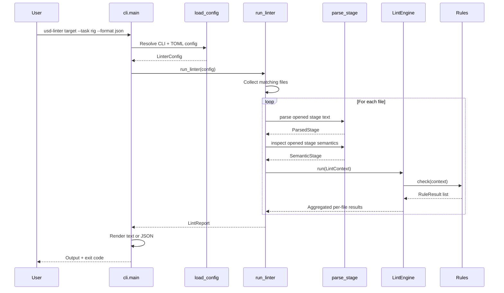

# Architecture

`usd-linter` is a small CLI-first Python project that opens USD stages through OpenUSD (`pxr` via `usd-core`), exports the root layer to text for lightweight source-oriented parsing, builds a semantic OpenUSD snapshot, and runs modular lint rules against both models.

The current implementation depends on `usd-core>=24.0` at runtime. It does not launch Maya, Blender, or Houdini, but it does require an OpenUSD Python runtime in the environment.

---

## System Overview

At a high level, the codebase has five responsibilities:

1. Parse CLI arguments.
2. Load and validate runtime configuration.
3. Collect target files and inspect each layer.
4. Run rules against a per-file lint context that carries text-derived and semantic data.
5. Render the report and return a process exit code.

```mermaid
flowchart TD
    User[User / CI] --> CLI[cli.py\nmain()]
    CLI --> Config[config.py\nload_config()]
    Config --> Runner[runner.py\nrun_linter()]
    Runner --> Collector[_collect_target_files()]
    Runner --> Open[pxr.Usd.Stage.Open]
    Open --> Parser[parser.py\nparse_opened_stage()]
    Open --> Semantic[semantic.py\ninspect_stage()]
    Parser --> Context[core/context.py\nLintContext]
    Semantic --> Context
    Context --> Engine[core/engine.py\nLintEngine.run()]
    Engine --> Registry[core/registry.py\nRuleRegistry]
    Registry --> Rules[rules/core/*.py]
    Rules --> Report[core/models.py\nLintReport]
    Report --> Output[text or json output]
    Output --> Exit[exit code 0 / 1 / 2]
```

---

## Runtime Flow

The main execution path starts in `src/usd_linter/cli.py`.



### What each step does

| Step | Module | Notes |
|------|--------|-------|
| Parse arguments | `cli.py` | Builds the CLI and forwards context flags like `--task`, `--dcc`, and `--project` |
| Build config | `config.py` | Loads TOML if present, validates values, and lets CLI flags override file settings |
| Collect files | `runner.py` | Accepts a single file or recursively scans a directory using include patterns |
| Open + parse layer | `runner.py` + `parser.py` | Opens the stage with `pxr`, exports the root layer to text, and extracts prims, stage metadata, references, payloads, and sublayers |
| Semantic inspection | `semantic.py` | Normalizes OpenUSD composition arcs, authored payloads, material bindings, variants, and xform stacks into dataclasses |
| Run rules | `core/engine.py` | Filters rules by applicability and enabled rule IDs |
| Build report | `core/models.py` | Stores findings, counts severities, and decides whether the run should fail |

---

## Module Map

This table is the quickest way to orient yourself in the code.

| Path | Role |
|------|------|
| `src/usd_linter/__init__.py` | Public package exports |
| `src/usd_linter/cli.py` | CLI entrypoint, output rendering, exit code handling |
| `src/usd_linter/config.py` | `LinterConfig`, TOML parsing, validation, CLI override merge |
| `src/usd_linter/runner.py` | Orchestrates file collection, parsing, engine execution, and final report sorting |
| `src/usd_linter/parser.py` | Opens stages with `pxr` and parses the exported text representation |
| `src/usd_linter/semantic.py` | Builds semantic OpenUSD snapshots from live `pxr` stages |
| `src/usd_linter/core/context.py` | Per-file context passed to every rule |
| `src/usd_linter/core/registry.py` | `BaseRule` contract and `RuleRegistry` container |
| `src/usd_linter/core/engine.py` | Runs applicable and enabled rules |
| `src/usd_linter/core/models.py` | `LintMessage`, `RuleResult`, `LintReport` |
| `src/usd_linter/rules/__init__.py` | Default rule registration |
| `src/usd_linter/rules/core/*.py` | Built-in rules currently shipped by default |
| `tests/*.py` | Config, CLI, runner, and integration-style behavior tests |
| `tests/rules/test_builtin_rules.py` | Rule behavior checks and useful examples of rule execution |

---

## Core Data Structures

These dataclasses are the main vocabulary of the system.

| Type | Defined In | Purpose |
|------|------------|---------|
| `LinterConfig` | `config.py` | Full runtime configuration for one invocation |
| `ParsedPrim` | `parser.py` | A single prim declaration found in the text layer |
| `AssetReference` | `parser.py` | A referenced asset path extracted from `@path@` syntax |
| `ParsedStage` | `parser.py` | Parsed representation of one file: prims, metadata, references |
| `SemanticStage` | `semantic.py` | Semantic OpenUSD snapshot: prims, composition arcs, payloads, material bindings, variants, xforms |
| `LintContext` | `core/context.py` | Per-file runtime context used by every rule |
| `LintMessage` | `core/models.py` | One finding with severity, location, and optional suggestion |
| `RuleResult` | `core/models.py` | Messages produced by one rule |
| `LintReport` | `core/models.py` | Final aggregated report across all scanned files |

---

## Parser Design

`src/usd_linter/parser.py` is the most important implementation detail to understand because it defines what the linter can and cannot currently inspect.

### Runtime contract

`parse_stage()` has a two-step model:

1. Open the requested file with `pxr.Usd.Stage.Open(...)`.
2. Export the root layer to text with `ExportToString()` and run the lightweight text parser on that exported content.

That means the parser is no longer a pure text-file fallback. If `usd-core` / `pxr` is missing, or if the stage cannot be opened by OpenUSD, linting stops with a `ParseError` before any rule runs.

### What the parser extracts

1. Root-level stage metadata like `defaultPrim = "Asset"`.
2. Prim declarations matching `def`, `over`, or `class`.
3. Prim hierarchy by tracking opening and closing braces.
4. Asset references using `@...@` syntax.
5. Payload paths using `@...@` syntax.
6. Sublayer paths from exported text and raw source fallback for USDA-style files.
7. Variant set declarations.

### How hierarchy tracking works

The parser uses two collections:

1. `pending_prims`: prims that were declared but whose `{` scope has not been opened yet.
2. `active_stack`: prims whose scope is currently open.

When a declaration is found, the parser computes the prim path from the current stack, stores the prim, and then updates scope state based on `{` and `}` found on the same line or following lines.

```mermaid
flowchart TD
    Start[Receive file path] --> Open[Open stage with pxr]
    Open --> OpenOk{Stage opened?}
    OpenOk -- No --> OpenError[Raise ParseError]
    OpenOk -- Yes --> Export[Export root layer to text]
    Export --> ExportOk{Export succeeds?}
    ExportOk -- No --> ExportError[Raise ParseError]
    ExportOk -- Yes --> Loop[Iterate lines]
    Loop --> Metadata{Top-level assignment?}
    Metadata -- Yes --> SaveMeta[Store stage metadata]
    Metadata -- No --> Refs[Scan @asset@ references]
    SaveMeta --> Refs
    Refs --> PrimDecl{Prim declaration?}
    PrimDecl -- Yes --> BuildPrim[Create ParsedPrim and path]
    BuildPrim --> OpenScope[Open pending prims for {]
    OpenScope --> CloseScope[Close active prims for }]
    PrimDecl -- No --> ScopeOnly{Line starts with { or }}
    ScopeOnly -- Yes --> ScopeUpdate[Update stacks]
    ScopeOnly -- No --> Continue[Continue]
    CloseScope --> Continue
    ScopeUpdate --> Continue
    Continue --> End[Return ParsedStage]
```

### Current parser limitations

| Limitation | Practical effect |
|------------|------------------|
| Requires `pxr` / `usd-core` | The linter cannot inspect files at all without an OpenUSD runtime |
| Export-to-text model | The parser reasons mostly over the exported text representation, not a rich semantic USD graph |
| Heuristic composition parsing | References, payloads, and sublayers are extracted reliably for common USDA-style patterns, but advanced composition constructs remain partial |
| Metadata only at top level | Only assignments before prim scopes are treated as stage metadata |

This is a deliberate tradeoff: OpenUSD handles file opening and format support, while the linter keeps a small, testable inspection layer for rule execution.

---

## Semantic Inspection

`src/usd_linter/semantic.py` is the companion to the lightweight parser. It receives the already-open `pxr.Usd.Stage` from `runner.py` and builds serializable dataclasses for USD concepts that are unsafe or incomplete to infer from exported text alone.

| Semantic area | What is extracted today | Example consumer |
|---------------|-------------------------|------------------|
| Composition | `Usd.PrimCompositionQuery` arcs, including payload arcs and target layers | `perf004_unused_payload` |
| Authored payloads | Payload asset path, target prim path, resolved path, and whether it composes into a payload arc | `perf004_unused_payload` |
| Materials | `UsdShade.MaterialBindingAPI.ComputeBoundMaterial()` result and binding relationship targets | `lookdev003_mesh_without_binding` |
| Variants | Variant set names, variants, active selection, authored-selection flag | Future variant rules |
| Xforms | Ordered xform ops, reset flag, local/world matrices, determinant, singular/NaN/Inf flags | Future xform-stack rules |

The parser remains the source-location helper. Rules should use `context.semantic_stage` for USD meaning and `context.parsed_stage` for approximate lines and authored text context.

---

## Rule System

Rules are decoupled from the parser and from the CLI.

Each rule implements the `BaseRule` interface from `core/registry.py`:

1. `applies(context)` decides whether the rule is relevant.
2. `check(context)` inspects the parsed data and returns a `RuleResult`.

### Current default rules

| Rule ID | File | What it checks |
|---------|------|----------------|
| `invalid_prim_name` | `rules/core/naming001_prim_name.py` | Prim names must match `config.name_pattern` |
| `unresolved_reference` | `rules/core/comp001_broken_references.py` | Referenced files must resolve on disk |
| `unresolved_payload` | `rules/core/comp002_broken_payloads.py` | Payload files must resolve on disk |
| `unresolved_sublayer` | `rules/core/comp003_broken_sublayers.py` | Sublayer files must resolve on disk |
| `sublayer_cycle` | `rules/core/comp004_sublayer_cycle.py` | USDA-style sublayer dependency chains must not form cycles |
| `suspicious_over_prim` | `rules/core/struct001_suspicious_over.py` | Empty or context-free `over` prims are reported as warnings |
| `missing_required_metadata` | `rules/core/meta001_missing_metadata.py` | Required stage metadata fields must exist |
| `invalid_root_prim` | `rules/core/struct002_invalid_root_prim.py` | The layer must contain a root prim, and `defaultPrim` must match an existing root prim when present |
| `max_hierarchy_depth` | `rules/core/struct003_max_hierarchy_depth.py` | Prim hierarchy depth must not exceed `config.max_hierarchy_depth` |
| `perf001_stage_file_size` | `rules/performance/perf001_stage_file_size.py` | Layer file size must stay under `config.max_stage_file_size_bytes` |
| `perf002_prim_count` | `rules/performance/perf002_prim_count.py` | Parsed prim count must stay under `config.max_prim_count` |
| `perf003_payload_count` | `rules/performance/perf003_payload_count.py` | Authored payload count must stay under `config.max_payload_count` |
| `perf004_unused_payload` | `rules/performance/perf004_unused_payload.py` | Authored payloads must compose into a real OpenUSD payload arc |

External packages can add rules through Python entry points in the `usd_linter.rules` group. Entry points must load to a `BaseRule` subclass, a `BaseRule` instance, or a zero-argument factory returning a `BaseRule`.

### Rule execution logic

```mermaid
flowchart LR
    Context[LintContext] --> Registry[RuleRegistry.get_applicable_rules]
    Registry --> Applies[rule.applies(context)]
    Applies --> Engine[LintEngine.run]
    Engine --> Enabled{Enabled in config?}
    Enabled -- Yes --> Check[rule.check(context)]
    Enabled -- No --> Skip[Skip rule]
    Check --> Result[RuleResult]
    Result --> Report[LintReport.messages]
```

### Why the design is useful

| Benefit | Explanation |
|---------|-------------|
| Easy to extend | A new rule is just a new class plus registry registration |
| Context-aware | Rules can activate only for a task, DCC, or project |
| Testable | Rules can be run directly from a handcrafted `LintContext` |
| Configurable | A rule can be globally registered but disabled in TOML |

---

## Configuration Resolution

`config.py` merges defaults, optional TOML settings, and CLI overrides into one `LinterConfig` object.

### Resolution order

1. Start with hard-coded defaults.
2. Load TOML from `--config` if provided.
3. Apply CLI flags on top of the config file.

That means CLI flags are the final source of truth for a run.

### Important defaults

| Field | Default |
|-------|---------|
| `output_format` | `text` |
| `fail_on` | `error` |
| `include_patterns` | `*.usd`, `*.usda`, `*.usdc`, `*.usdz` |
| `check_references` | `true` without TOML, `false` unless declared in TOML |
| `check_suspicious_over` | `true` without TOML, `false` unless declared in TOML |
| `allowed_root_prims` | `Asset`, `Root`, `World` |
| `required_stage_metadata` | `defaultPrim` |
| `name_pattern` | `^[A-Z][A-Za-z0-9_]*$` |
| `max_stage_file_size_bytes` | `52428800` |
| `max_prim_count` | `10000` |
| `max_payload_count` | `100` |

When no `--config` file is provided, the linter runs the built-in core rule set with default values. When a TOML file is provided, some core rules become declarative (`name_pattern`, `required_stage_metadata`, boolean toggles), while others still remain enabled by default based on current implementation. Treat `config.py` as the source of truth for exact activation behavior.

### Declarative rule keys

| Key TOML | Internal rule | Effect |
|----------|---------------|--------|
| `check_references = true` | `unresolved_reference` | Validates that `@asset@` references resolve on disk |
| `check_suspicious_over = true` | `suspicious_over_prim` | Reports `over` prims as warnings |
| `name_pattern = "regex"` | `invalid_prim_name` | Validates prim names against the configured regex |
| `allowed_root_prims = [...]` | `invalid_root_prim` | Config surface currently exposes root-prim policy, but verify current rule behavior against implementation before relying on allow-list enforcement |
| `required_stage_metadata = [...]` | `missing_required_metadata` | Requires listed stage metadata fields to exist |

That gives the config a practical mental model:

1. No TOML: run the built-in defaults.
2. TOML present: some rule families become opt-in, but activation is not fully declarative across every core rule yet.

---

## Report and Exit Codes

The report model is intentionally simple.

1. Each rule produces zero or more `LintMessage` objects.
2. All messages are accumulated into one `LintReport`.
3. The report decides whether the process should fail based on `fail_on` severity.

| Exit code | Meaning |
|-----------|---------|
| `0` | No findings at or above the configured failure threshold |
| `1` | Findings exist at or above `--fail-on` |
| `2` | Invalid config, invalid target, or unsupported parsing state |

`cli.py` can render the report in two ways:

| Format | Behavior |
|--------|----------|
| `text` | Human-readable messages followed by a summary line |
| `json` | Structured payload from `LintReport.to_dict()` |

---

## Format Support

Current format support is intentionally practical rather than aspirational.

| Format | Status | Notes |
|--------|--------|-------|
| `USDA` | Supported | Best-covered path in fixtures, rules, and parser-oriented tests |
| `USDC` | Supported via `pxr` | Backed by real integration tests that create and parse `.usdc` files through OpenUSD |
| `USDZ` | Supported via `pxr` | Backed by real integration tests that package and parse `.usdz` files through OpenUSD |

The important constraint is that binary support is provided by OpenUSD, not by the lightweight text parser itself.

---

## DCC Support

Current DCC support is rule-based and intentionally heuristic.

| DCC | Current focus | What the rules catch today | Current limit |
|-----|---------------|----------------------------|---------------|
| `maya` | Export cleanup | leaked namespaces, `Shape` suffixes, auto-numbered transform names | Does not validate full Maya shading, rig semantics, or round-trip fidelity |
| `houdini` | Network residue and default naming | `lopnet` artifacts and default primitive names like `geo1` | Does not inspect LOP graph semantics, variants, or Solaris-specific composition behavior |
| `blender` | Default naming and USD Skel hygiene | default material names and missing `SkelRoot` around `Skeleton` prims | Does not validate Blender material graph conversion or full armature export fidelity |

The practical intent is to catch high-frequency export mistakes that are cheap to detect in CI, not to claim complete DCC compatibility.

---

## How to Read the Code Quickly

If you want to understand the project fast, read the files in this order:

1. `src/usd_linter/cli.py`
2. `src/usd_linter/config.py`
3. `src/usd_linter/runner.py`
4. `src/usd_linter/parser.py`
5. `src/usd_linter/core/registry.py`
6. `src/usd_linter/core/engine.py`
7. `src/usd_linter/rules/core/*.py`
8. `tests/test_runner.py` and `tests/rules/test_builtin_rules.py`

That sequence mirrors the actual runtime path and then shows how behavior is verified.

---

## Test Coverage as Documentation

The tests are small, but they are useful reference points:

| Test file | What it teaches |
|-----------|-----------------|
| `tests/test_cli.py` | JSON output shape and basic exit-code behavior |
| `tests/test_config.py` | Default config values and CLI override precedence |
| `tests/test_runner.py` | End-to-end execution on valid, invalid, and directory targets |
| `tests/rules/test_builtin_rules.py` | How parsed stages and contexts are fed into the rule engine |

The fixtures in `tests/fixtures/` are also worth reading because they show the exact kind of exported USDA-like text the parser and rules are built around.

---

## Mental Model

The simplest correct way to think about this project is:

1. The CLI turns user input into a `LinterConfig`.
2. The runner turns files into `ParsedStage` objects.
3. The engine turns `ParsedStage + config + context` into rule results.
4. The report turns rule results into output and an exit code.

If you keep that mental model in mind, the rest of the code becomes much easier to navigate.
